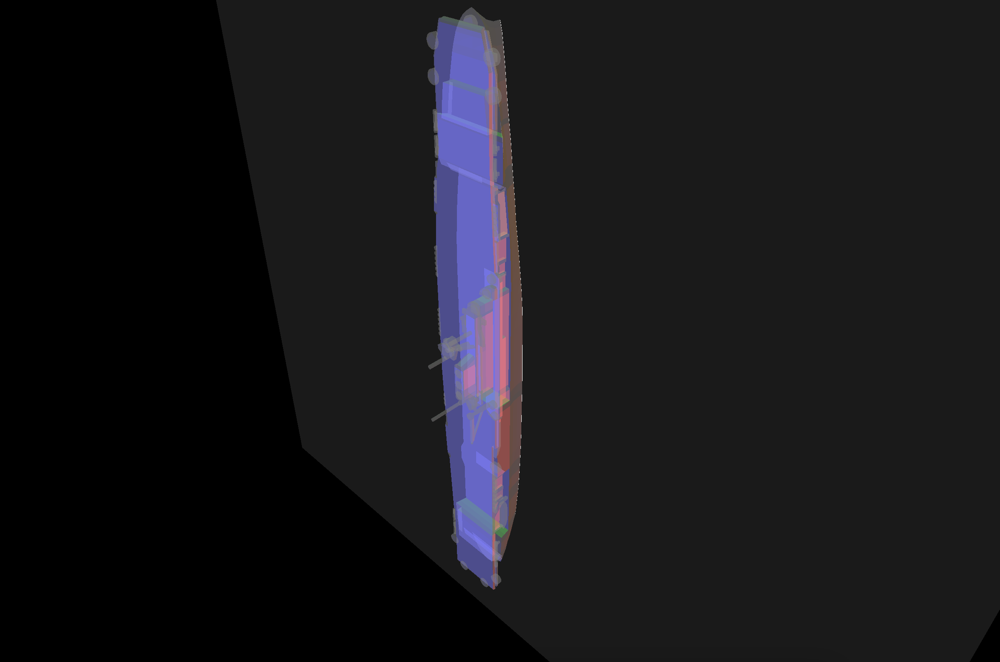
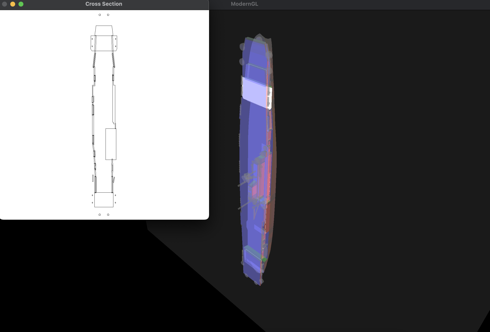

# warship_slicer

This is just a model slicing tool I built a while ago with OpenGL for looking at .stl model cross sections. I'd really appreciate it if you could test it out and give any feedback!

## Installation

Clone the repository

```bash
git clone https://github.com/ineedsleep9/warship_slicer.git
```

Install the libraries in requirements.txt

```bash
pip install -r requirements.txt
```
## Usage/Examples

After installing everything, you can run the slicer with
```bash
python demo.py
```

If you would like to use your own .stl file, you can  specify the path to your .stl file:
```bash
python demo.py --path="your_file.stl"
```

If you would like to turn off the cross-section view:
```bash
python demo.py --cross_section=False
```

You can click and hold to translate the model, and right-click and hold to rotate the model.

Press "S" to turn off/on movement for the slicing plane, and "M" to turn off/on movement for the model. By default, the program starts with movement for the model activated and movement for the slicing plane deactivated. 

Note that both modes can be activated at the same time, or can be deactivated at the same time.

You should see something like this when you run the demo: 



Here is an example of a cross-section you might see:



## License

[MIT](https://choosealicense.com/licenses/mit/)


## Acknowledgements

Special thanks to ktkloss on cgtrader for the model of USS Enterprise used in the demo. You can find the model here: https://www.cgtrader.com/free-3d-print-models/miniatures/vehicles/uss-enterprise-model-for-small-scale-printing

Special thanks to connorslade, whose slicer project inspired parts of this implementation, for his help! You can check out his amazing slicer here: https://github.com/connorslade/mslicer